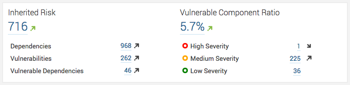

Dependency-Check Plugin for SonarQube
=====================================

Integrates Dependency-Check reports into SonarQube v5.1 or higher. If components being 
analyzed by Dependency-Check are non-source files (jar, dll, etc), then the value of 
sonar.import_unknown_files needs to be set to True in the SonarQube configuration.

Screenshots
-------------------

Usage
-------------------

> $ mvn clean package

Distribution
-------------------
Ready to use binaries are available from [bintray]. To install, shutdown Sonar and copy the jar to your SonarQube extensions->plugins directory. Then, start Sonar. 

Copyright & License
-------------------

Dependency-Check Sonar Plugin is Copyright (c) Steve Springett. All Rights Reserved.

Permission to modify and redistribute is granted under the terms of the [LGPLv3] license.

  [LGPLv3]: http://www.gnu.org/licenses/lgpl.txt
  [bintray]: https://bintray.com/stevespringett/owasp/dependency-check-sonar/
